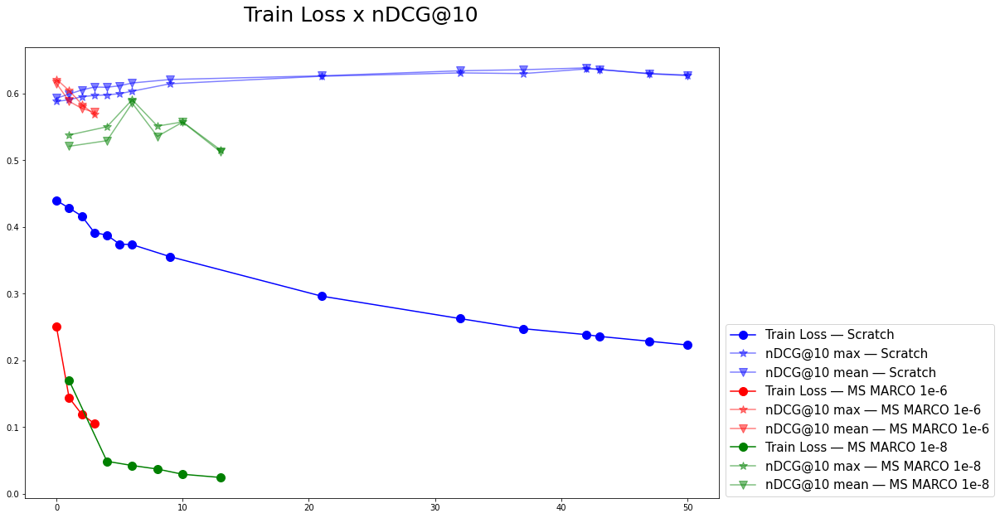

# ia368v_dd_class_09
InPars training.

## Notebooks created for this activity

* [trec_covid_LLM_query_expansion.ipynb](trec_covid_LLM_query_expansion.ipynb): Create synthetic datasets to fine-tune a reranking model, interacting with OpenAI `text-davinci-003` model to create new TREC COVID queries.

* [trec_covid_BM25_negative_selection.ipynb](trec_covid_BM25_negative_selection.ipynb): Negative TREC COVID documents selections for the generated synthetic queries.

* [DL_reranking_fine_tuning.ipynb](DL_reranking_fine_tuning.ipynb): Fine-tune the `microsoft/MiniLM-L12-H384-uncased` model using the created synthetic datasets for TREC COVID.

* [DL_reranking_evaluation.ipynb](DL_reranking_evaluation.ipynb): Evaluate the fine-tuned model in a BM25 reranker pipeline, over TREC COVID queries.

## Final results

The final result was way bellow the [InPars](https://arxiv.org/abs/2202.05144) paper numbers, with nDCG@10=0.6381, after 42 training epochs using LR=1e-8.

 

Check [here a presentation](https://docs.google.com/presentation/d/1bwrjAPdl13gecWz-tbQgPO-dtCkroh2VbsTf3FP1zjw/edit?usp=share_link) commenting this exercise resolution.
